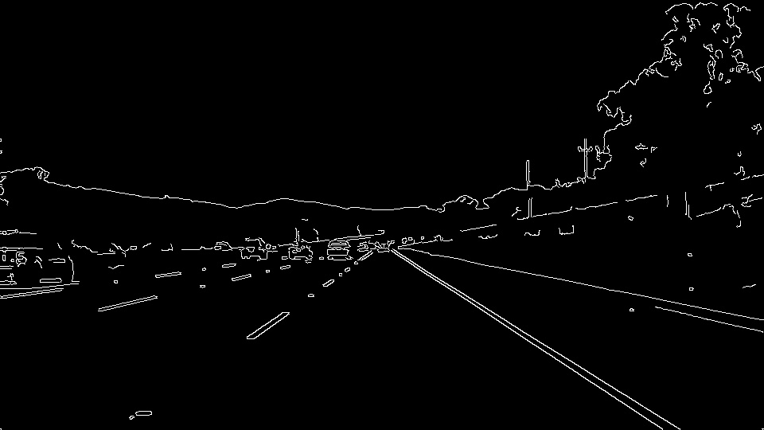

# **Finding Lane Lines on the Road** 

## Pipeline

My pipeline consisted of the following steps: 

1. Converted to grayscale.

2. Denoised using Gaussian filter with kernel 3.

3. Detected edges using Canny algorithm. Threshold values are calculated using the median of pixel intensities. More info at: [Zero-parameter, automatic Canny edge detection with Python and OpenCV](http://www.pyimagesearch.com/2015/04/06/zero-parameter-automatic-canny-edge-detection-with-python-and-opencv/)

4. Masked region of interest.

5. Detected all possible lines using Hough Transform algorithm.

6. Filtered out lines which don't look like lane ones in `draw_lines()` function:

   1. Divided all lines to left and right lists by the slope of the line. Lines with the negative slope are left lane line candidates. Lines with positive slope are right lane line candidate. Lines with slope = 0 are skipped.

   2. Tried to filter out line with abnormal high or low values of slope. For left lines median value is -0.72, standard deviation is about 0.07. For right lines median is 0.634, stdev is 0.05. All lines with differences between slope of a line and median is more than 2 values are filtered out.

   3. Got lines which are placed at the bottom of the image. Two from left lines list and two from right lines list, since each lane line consists of outer egde line and inner edge line.

   4. Calculated middle line of the two edge lines by averaging slope and `x` coordinate.
   
   5. Extrapolated both lane lines to the bottom of an image.
   
   6. Extrapolated both lane lines to the top (down to the lowest detect value of `y` coordinate).

7. Added image with lines to the inital image.

## Shortcomings and possible improvements

1. To detect edges I used auto detection of low and high thresholds for the Canny call. Probably some tweaks required with different light conditions.

2. Hardcoded values are used for the Hough Transform call. These values need to be tweaked with different image resolution. 

3. Difficult weather conditions such as fog, rain and snow breaks Hough Transform as well.

4. Region of interest is fragile place as well. Vertices for region of interest need to be changed if we change camera point of view.

5. I use median and stdev of left and right slopes. These values need to be changed if camera position or point of view is changed.

6. When car will try to change lane we will have vertical lane with slope close equals to 0. And all calculations where we need to divide by slope value will be broken.

7. Uphills, downhills, turns require more sophisticated line detection algorithms.

8. Shadows from the trees will break results from the Hough Transform part.

## Possible improvements

* We can add some ML to the algorithm to teach and use best suitable values instead of hardcoded ones.

* I think there should be different profiles for certain weather and light conditions, e.g. if there is a rain or a snow we need change kernel at the denoise step and probably increase r (distance resolution) and θ (angular resolution) of the Hough grid.

* We can use generalized version of Hough Transform to detect curve lane lines.

* As for shadows we will have more horizontal edges. We can filter out such edges with some stat data, e.g. normal value of the slope. 
